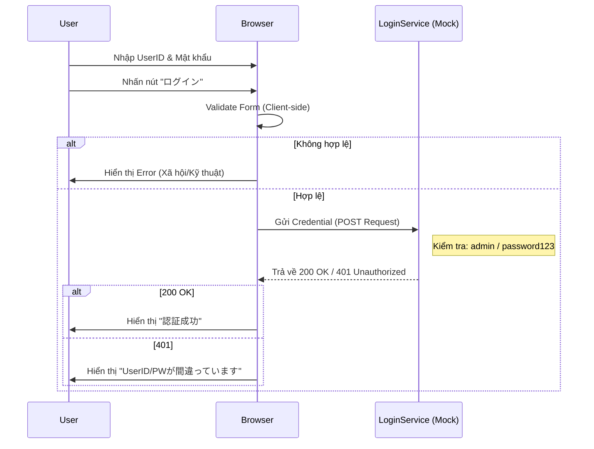

# 🏗️ Architecture Design: Login Flow (Mock Authentication)

Tài liệu này mô tả luồng logic từ Client đến "Mock Server" cho hệ thống Tài chính Nhật Bản.

## 1. Biểu đồ Sequence (Sequence Diagram)

## 2. Đặc tả Logic (Business Logic Implementation)

1. **Client-side Validation**:
    - Không được để trống.
    - Password tối thiểu 8 ký tự.
2. **Mock Authentication**:
    - Tài khoản cố định: `admin`, `user1`. 
    - Mật khẩu: `password123`.
3. **Phản hồi lỗi (Japanese)**:
    - Rỗng: `必須項目です` (Trường bắt buộc).
    - Sai thông tin: `ユーザーIDまたはパスワードが正しくありません`.

---
> [!WARNING]
> Mọi mật khẩu trong Mock service này phải được xử lý cẩn thận, không được in ra nhật ký (logs).

---
> [!NOTE]
> Được thiết kế bởi SA Agent.
